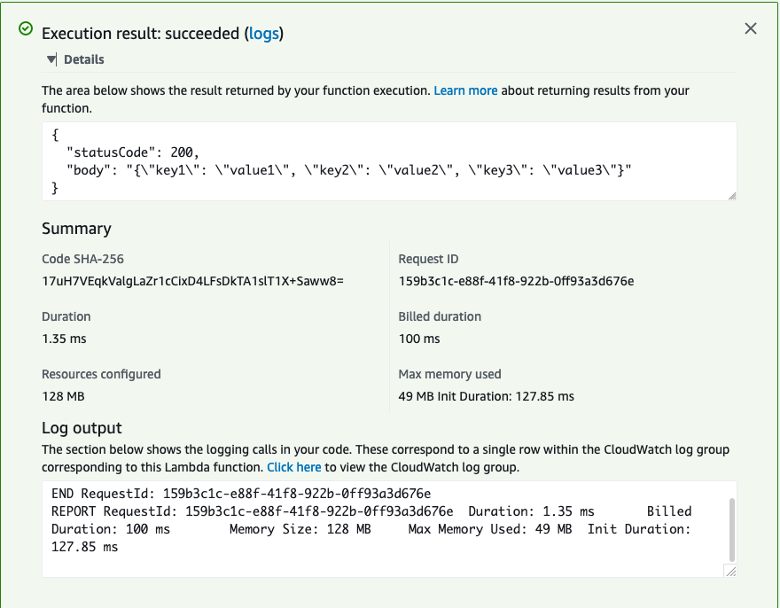

# Our first Lambda Function

Let's skip the usual introduction for books like this, and dive straight to a real working example. Let's go and build our first lambda function.

## Build, deploy and test in 8 steps

**Step 1:** Logon to the AWS Console, and search for Lambda:


**Step 2:** Click the `create function` button


**Step 3:** Here, we fill out a few function details:

* Function Name: `example_function`
* Runtime: Python 3.8
* Permissions: *Leave as-is for now*

Then click the `Create Function` button


> Believe it or not -- our lambda function is already created!! 
> In just 3 short steps!

Obviously you don't believe me, so let's create a test for this.

**Step 4:** In the top right of the screen, select the *Select a test event* dropdown box, and then click on *Configure test events*.


**Step 5:** Give this test event a name, I randomly chose 'a', and then hit the `Create` button. We now have a test event.


**Step 6:** You'll now be taken back to the function page -- just hit the test button, and voila(!), you've tested your first lambda function!


You're probably still skeptical. Now let's edit code and see what we get.

**Step 7:** Scroll down to the **Function code** section, and paste the following code into the designer:

```python
def lambda_handler(event, context):
    # TODO implement
    return {
        'statusCode': 200,
        'body': json.dumps(event)
    }

```

The only real difference in the code, is that now we're going to dump the `event` object into the `body` of the return object, rather than just a static string of "Hello from Lambda". Don't worry about what `event` or `body` mean for now, let's just test this out first.


**Step 8:** Let's execute again, by hitting the `Test` button:



What you've just printed out in the json dump of the Test event, we created in step 5. So you've now officially executed code on AWS!!

## What just happened

Right now you're probably wondering what the hell happened, and it's easy to lose sight of just how magical this is.

You've just ran your code on AWS.

Let me say that again, in uppercase for dramatic effect:

> YOU'VE JUST RUN CODE ON AWS!!!

If you have previous experience with AWS on something like EC2, you know how hard it is to run code on the cloud. You first need to generate a key-pair, use that pair to provision a Virtual Machine(VM), logon to the VM with the private key, load your code onto the VM, hope to God the runtime on the VM is compatible and then run the code.

Don't even get me started on something like Fargate or EKS, where you need to create containers, and upload them to repositories.

It's a lot of work to run code on AWS ....

Or at least, it **used** to be a lot of work to run code on AWS.

With Lambda we don't need keypairs, Elastic IPs or Dockerfiles. You can literally pass code to AWS for it to run (as the example demonstrated), and it'll work.

If you haven't had AWS experience before -- congratulations, you're jumping onto the bandwagon at the precise time when it's easiest and most beneficial, and this is why lambda functions are a powerful tool to learn.

10 years ago, learning AWS, exclusively meant learning to run VMs on the EC2. Today, we have a wealth of options, and Lambda is the best options for beginners and experts alike, not only is the learning curve easier it's also more future-proof as more applications are going to be built using lambda than any other platform.

So let's get learning.
