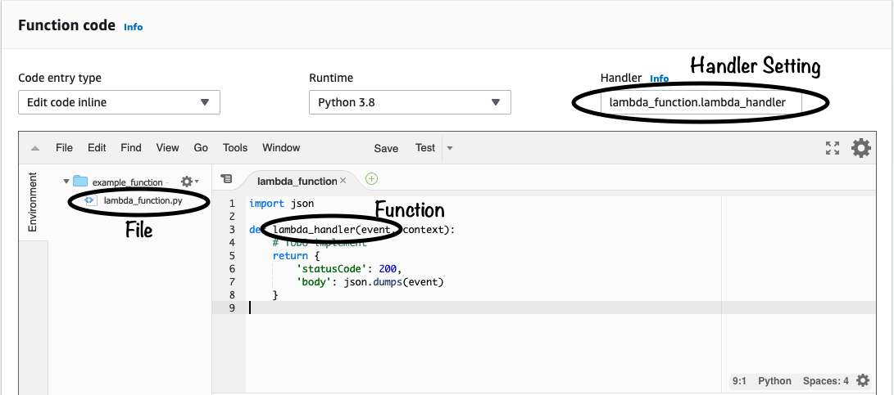

# What is the Handler?

When we changed out Function Code in the previous chapter, you might have noticed the `lambda_handler` function, and thought to yourself "hmmm... that looks important". And you're right -- it is important.

The handler function is the starting point of your code. It's the *python* function that is executed when your *lambda* function runs.

So let's go back to our Function Code from chapter 1:

```python
def lambda_handler(event, context):
    # TODO implement
    return {
        'statusCode': 200,
        'body': json.dumps(event)
    }

```

Here the handler is the function `lambda_handler`. When you create a lambda function from the console, it is automatically populated with a single .py file with generic handler function. But we'll learn in later chapters how you can provide lambda any number of .py files as your code, and then specify the handler using the following convention:

> **<file_name_without_extension>.<function_name>**

Let's take a look in the console again, notice 3 things:

* The Handler is set to lambda_function.lambda_handler
* lambda_function.py is the name of our .py file
* lambda_handler is the name of function in our code



Handler functions must always take two arguments, `event` and `context`, and they may return a value, in short they always have to look like this:

```python
def lambda_handler(event, context):
    ...
    return some_value
```

Now let's look at the `event`, `context` and return value individually.

## Event

`event` is the data that's passed to the function upon execution. In the previous chapter, we used the console to create a test `event` to be passed to the Lambda Function.

In real-life, the event can come from whatever triggers the lambda, a good example, if the lambda were triggered from an HTTP api call via API Gateway, then the event object would look something like this:

```json
{
    "resource": "/",
    "path": "/",
    "httpMethod": "GET",
    "requestContext": {
        "resourcePath": "/",
        "httpMethod": "GET",
        "path": "/Prod/",
        ...
    },
    "headers": {
        "accept": "text/html",
        "accept-encoding": "gzip, deflate, br",
        "Host": "xxx.us-east-2.amazonaws.com",
        "User-Agent": "Mozilla/5.0",
        ...
    },
    "multiValueHeaders": {
        "accept": [
            "text/html"
        ],
        "accept-encoding": [
            "gzip, deflate, br"
        ],
        ...
    },
    "queryStringParameters": {
        "postcode": 12345
        },
    "multiValueQueryStringParameters": null,
    "pathParameters": null,
    "stageVariables": null,
    "body": null,
    "isBase64Encoded": false
}
```

As you can see it's a very rich event, including the Http Method used, the User-Agent, QueryStringParameters etc. `event` is usually a Python dictionary, from which data can easily be extracted using the tools we're already familiar with:

```python
postcode = event['QueryStringParameters']['postcode'] # or if we're not sure if postcode is present:
postcode = event.get('QueryStringParameters',{}).get('postcode','n/a')
```

`event` can be thought of as the 'purpose' the lambda. When you hit the `Test` button on the console, you invoked the lambda and passed it the test `event` -- the lambda then took that event and printed it out.

As we dive deeper into AWS Lambda, we'll find more and more possible events that can trigger lambdas, such as:

* An HTTP call to API Gateway
* A message arriving on an SQS Que
* A file being put into an S3 Bucket
* A update to DynamoDB
* An event from cloudwatch
* .... and the list goes on...

Each event will have a different format and carry different payloads, but the pattern is always the same. The lambda function is triggered, it will inspect its event and perform a logic on the event before returning and terminating.

Now that we've covered `event`, let's move onto `context`.

## Context

`context` is a Python objects that implements methods and has attributes. It's main role is to provide information about the current execution environment. Unlike `event`, the methods and properties of the `context` object remain the same regardless of the lambda was invoked or triggered. 

### Context methods

* **get_remaining_time_in_millis** – Returns the number of milliseconds left before the execution times out.

### Context properties

* **function_name** – The name of the Lambda function.
* **function_version** – The version of the function.
* **invoked_function_arn** – The Amazon Resource Name (ARN) that's used to invoke the function. Indicates if the invoker specified a version number or alias.
* **memory_limit_in_mb** – The amount of memory that's allocated for the function.
* **aws_request_id** – The identifier of the invocation request.
* **log_group_name** – The log group for the function.
* **log_stream_name** – The log stream for the function instance.

We will use the `context` object later on in the book, but for now we can likely ignore it. Let's move onto the return value

## Return Value

Lambda functions can be triggered both synchronous and asynchronous fashion, which means sometimes it doesn't makes sense to provide a return value.

However when invoked synchronously (e.g. via API), the return value will be returned to the calling application, and usually must be returned in a specific structure.

For example, AWS Lambda console uses the synchronous invocation type, so when you invoke the function using the console, the console will display the returned value (serialized into json)

> Return values must always 

## Conclusion

So to conclude

* All Lambda functions must have a Handler function
* Handler functions must accept 2 (and only 2) arguments:
  * `event`: The data from the event that triggered the function
  * `context`: The data about the execution environment of the function
* The function may return a value, but whether that return value is used depends on the invocation type

## Further reading

* [Lambda Services](https://docs.aws.amazon.com/lambda/latest/dg/lambda-services.html)
* [Lambda Context](https://docs.aws.amazon.com/lambda/latest/dg/python-context.html)