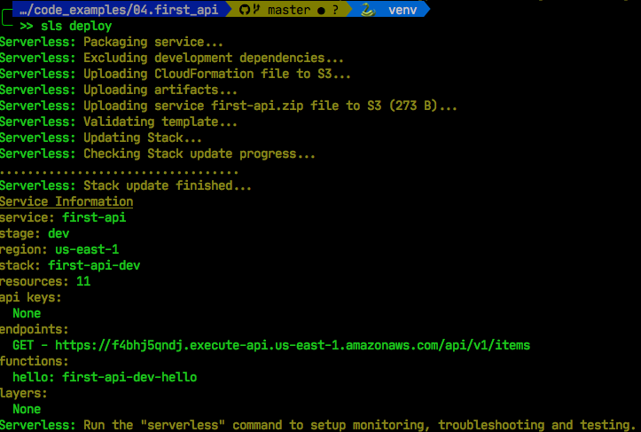
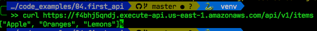

# Our First API

## What is an API?

Let's say we're looking to do the following:

* Build a HTTP API that responds to GET requests on `/api/v1/item`
  * GET request will have no body, query string or path parameter
* The API will respond in json with a list of the following:
  * Apple
  * Oranges
  * Lemons
* The HTTP response will have a status code of 200.

For those familiar with frameworks like Flask or Django is an easy task, but let's see how to do this with Lambda and API Gateway.

## Write the Python Code

First let's start with what we know, let's write a python function that will return the json.

```python
import json

def get_item(event, context):
    items = ['Apple', 'Oranges' , 'Lemons']
    api_response = {
        "statusCode": 200,
        "body": json.dumps(items)
    }
    return api_response
```

The code is simple enough, it returns a list of items (serialized in JSON), but wrapped up in a python dictionary. We'll cover why we need the dictionary later, for now what's important to note is that:

* We have a lambda function with a handler called 'get_item'
* The handler expects two arguments `event` and `context`
* It returns an object with a list of items in the `body`
* The return object has an attribute `statusCode` with a value of 200

We save this to a file called `handler.py`

## API Configuration

For API configuration, we use serverless framework, and populate our serverless.yml file with the following:

```yaml
service: first-api

provider:
  name: aws
  runtime: python3.8

functions:
  hello:
    handler: handler.get_item
    events:
      - httpApi:
          method: GET
          path: /api/v1/items
```

## Deploying our API

With just these two files in the same directory:

* handler.py
* serverless.yml

We can now deploy our function with the `sls deploy`.



That's it. 

We now have a working API on AWS!!

No really -- you've just deployed your first API!!

## Test the API

You probably don't trust me -- surely a handful lines of code can't create an API out of thin-air. So let's test this out, if you look at the output of our `sls deploy` command you'll see an entry called endpoints, under which there is a url:

> GET - https://f4bhj5qndj.execute-api.us-east-1.amazonaws.com/api/v1/items

When you run this on your own, you'll get a different url or couse, but this url is where our API was deployed. We can now easily test if indeed there's a working API by pasting the url in our browser, or performing the curl command:



That really is it, we now have a working API that can respond to HTTP requests deployed on AWS.

## Conclusion

In 20 lines of code, we setup a complete API, that's really impressive.

The API isn't just functional, it has TLS encryption, is completely scalable, and even deployed to multi-AZ. If you didn't understand all of that, don't worry, the lambda functions take away the heavy lifting developers had to previously do, which means you don't have dig deep on multi-AZ deployments anymore -- they happen by default.

We now can focus on writing business logic, and not be worried about Apache Webserver configurations, or how to configure WSGI or Gunicorn.

But this API is boring, it returns a static list of items. Let's spice things up a bit.
