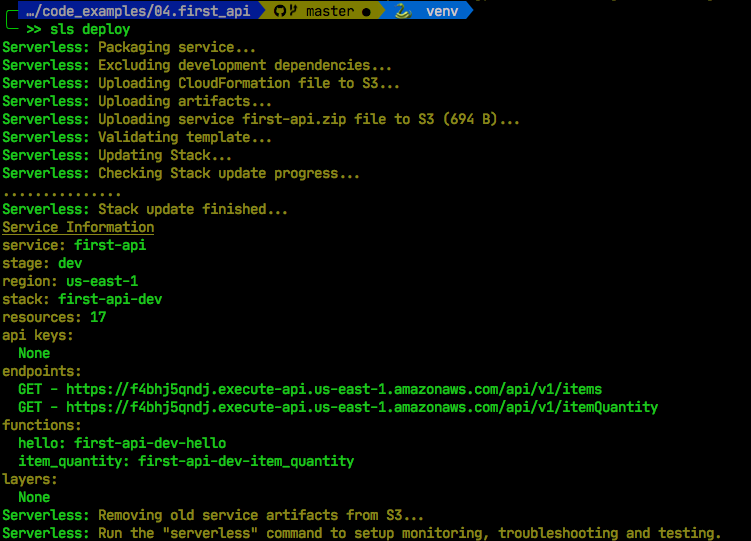
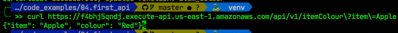

# Our second API

Let's add some complexity to the API. Let's say, we have a list of items but want to query the colour of the item as follows:

| Item          | Colour|
| ------------- |--------|
| Apple         | Red      |
| Orange        | Orange      |
| Lemon         | Yellow      |

We will return the colour of an item based on the query string parameter for our API, for example:

> /api/v1/itemColour?item=Apple

So let's add a function to our code by creating a new file, called item_colour.py, and put the following code in it.

```python
import json

# define item colors
item_colour = {
    "Apple": "Red",
    "Orange": "Orange",
    "Lemon": "Yellow",
}

def handler(event, context):
    """
    Args:
      event['queryStringParameters']['item']: Item to check colour on
    return:
      colour: Colour of item
      item: Item requested
    """

    item = event['queryStringParameters']['item']
    colour = item_colour[colour]

    api_response = {
        "statusCode": 200,
        "body": json.dumps({
            "item": item,
            "colour": colour,
        })
    }

    return api_response
```

I've defined an item_colour dictionary that has the colours of all our items. Notice how it exists outside our handler, we cover that the *lifecyle of a function* chapter.

The key difference here is that we look for the `queryStringParameter` in the `event` object. This event is populated for us by API Gateway, and contains all the Query String parameters in a nice Python dictionary.

For example, if the client requested the following from our API:

> api.com/api/v1/shirt?size=m&colour=red&style=short

then our `queryStringParameter` would be a python dictionary that looks like this:

```python
{
    "size": "m",
    "colour": "red",
    "style": "short"
}
```

Now all we have to do is add this function to our serverless.yml file, and we can deploy our second API.

## Configure API

To add a new api endpoint, we simply add a block to `functions`.

```yaml
service: first-api

provider:
  name: aws
  runtime: python3.8

functions:
  hello:
    handler: handler.get_item
    events:
      - httpApi:
          method: GET
          path: /api/v1/items
  # Our new function
  item_quantity:
    handler: item_quantity.handler  # notice we have a new filename
    events:
      - httpApi:
          method: GET
          path: /api/v1/itemColour  # a new endpoint
```

Now we redeploy the function by using `sls deploy`, and voila, our second endpoint has been added to the API.



And now we can test the item Quantity end point, by curl-ing the api endpoint:



And that's it. We're now got a pretty decent API setup. 

> Note: You're probably thinking Colour is a typo, and that I am unprofessional as to include such a blatant error throughout the code. It's not. Every country in the world spells it with an additional 'u' -- except one! So we'll be using the **correct** spelling in this book. If you're feeling a bit triggered, you're probably from that country, just wait till I introduce you to football.
